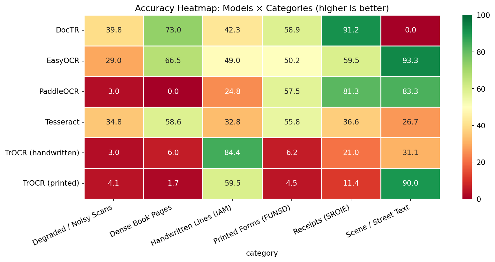
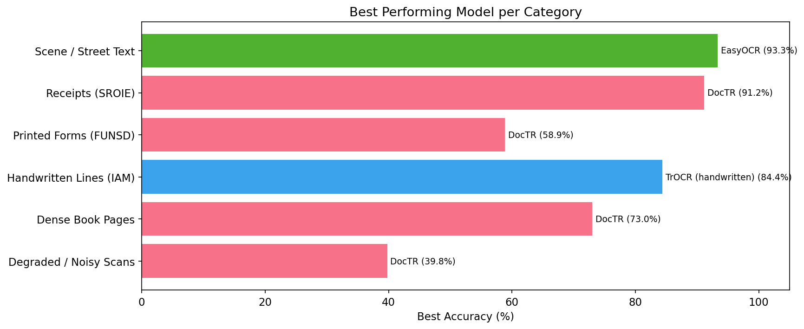
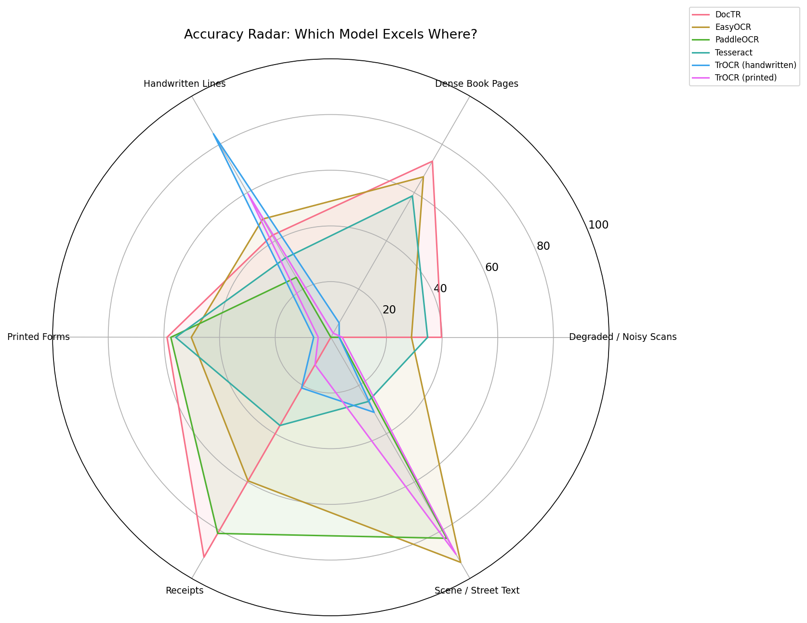

# OCR Model Benchmark: Which OCR Engine Should You Actually Use?

A practical benchmark comparing **6 OCR models** across **6 real-world dataset categories** (216 total evaluations) to answer one question — which model is best for *your* use case?



## Key Findings

| Use Case | Best Model | Accuracy |
|---|---|---|
| Scene / Street Text | **EasyOCR** | 93.3% |
| Receipts & Invoices | **DocTR** | 91.2% |
| Handwritten Text | **TrOCR (handwritten)** | 84.4% |
| Dense Book Pages | **DocTR** | 73.0% |
| Printed Forms | **DocTR** | 58.9% |
| Degraded / Noisy Scans | **DocTR** | 39.8% |



**There is no single best OCR model.** DocTR wins 4/6 categories, EasyOCR dominates scene text, and TrOCR is the clear specialist for handwriting. Pick the right tool for your data.

## Models Tested

| Model | Type | Avg Accuracy | Avg Speed |
|---|---|---|---|
| EasyOCR | Local (CRAFT + CRNN) | 57.9% | 6.1s |
| DocTR (Mindee) | Local (DBNet + ViT) | 50.9% | 2.3s |
| PaddleOCR | Local (DB + CRNN) | 41.7% | 1.1s |
| Tesseract | Local (LSTM) | 40.9% | 0.6s |
| TrOCR (printed) | Local (ViT + Transformer) | 28.5% | 1.2s |
| TrOCR (handwritten) | Local (ViT + Transformer) | 25.3% | 1.5s |
| Mistral OCR | API (Pixtral-12B) | — | — |

> Mistral OCR code is included but benchmarks are excluded due to free-tier API rate limits. Run it yourself with your own API key.

## Datasets

All sourced from HuggingFace — 6 images per category, 36 images total:

| Category | Source | What It Tests |
|---|---|---|
| Printed Forms | FUNSD | Structured forms, mixed fonts, boxes |
| Handwritten Lines | IAM Handwriting | Cursive and print handwriting |
| Receipts | Invoices & Receipts OCR v1 | Small fonts, columns, special chars |
| Scene / Street Text | IIIT-5K | Words on signs, storefronts |
| Dense Book Pages | FUNSD (test split) | Paragraphs with complex layouts |
| Degraded / Noisy Scans | Programmatically degraded FUNSD | Noise, blur, JPEG artifacts |

## Visualizations

All charts are auto-generated and saved to `results/visualizations/`:



<details>
<summary>View all generated charts</summary>

- `01_cer_*.png` — CER bar charts per category
- `02_accuracy_*.png` — Accuracy bar charts per category
- `03_cer_heatmap.png` — CER heatmap (models x categories)
- `04_accuracy_heatmap.png` — Accuracy heatmap
- `05_best_per_category.png` — Best model per use case
- `06_wer_comparison.png` — Word Error Rate grouped comparison
- `07_processing_time.png` — Speed comparison
- `08_radar_chart.png` — Radar chart (model strengths)
- `09_summary_table.png` — Overall summary table
- `10_category_winners.png` — Category winners table
- `composite_*.png` — All 6 categories in one image

</details>

## Project Structure

```
├── config.py                  # Central config (paths, API keys, model settings)
├── run_evaluation.py          # Run all 6 local models (subprocess isolation)
├── run_api_models.py          # Run Mistral OCR (API, separate due to rate limits)
├── _run_single_model.py       # Subprocess worker script
├── models/
│   ├── base.py                # Abstract OCRModel interface
│   ├── tesseract_ocr.py       # Tesseract (pytesseract)
│   ├── easy_ocr.py            # EasyOCR
│   ├── paddle_ocr.py          # PaddleOCR v2.8
│   ├── trocr_model.py         # TrOCR (printed + handwritten variants)
│   ├── doctr_model.py         # DocTR (Mindee)
│   └── mistral_ocr.py         # Mistral Pixtral API
├── evaluation/
│   ├── metrics.py             # CER, WER, accuracy (using jiwer)
│   └── visualize.py           # 10 chart types (matplotlib + seaborn)
├── datasets/                  # 6 categories x 6 images + ground truth
└── results/
    ├── scores/all_results.csv # 216 rows of benchmark data
    └── visualizations/        # 22 auto-generated charts
```

## Quick Start

### Prerequisites

- Python 3.10+
- [Tesseract OCR](https://github.com/tesseract-ocr/tesseract) installed on your system

### Setup

```bash
git clone https://github.com/Harish-K22/OCR.git
cd OCR
python -m venv venv
venv\Scripts\activate        # Windows
# source venv/bin/activate   # Linux/Mac

pip install -r requirements.txt
```

### Run the Benchmark

```bash
# Run all 6 local models on all 6 categories
python run_evaluation.py
```

This runs each model in a separate subprocess, saves results to `results/scores/all_results.csv`, and generates all visualizations.

### Run Mistral OCR (Optional)

```bash
# Create a .env file with your API key
echo "MISTRAL_API_KEY=your_key_here" > .env

# Run Mistral on all images (30s delay per request for free tier)
python run_api_models.py
```

## Metrics

All text is normalized before comparison (lowercase, remove punctuation, collapse whitespace):

- **CER** (Character Error Rate) — edit distance at character level (0 = perfect)
- **WER** (Word Error Rate) — edit distance at word level
- **Accuracy** — `(1 - CER) * 100` as a percentage
- **Processing Time** — wall-clock seconds per image

## Results at a Glance

| Model | Avg CER | Avg WER | Avg Accuracy | Avg Time |
|---|---|---|---|---|
| EasyOCR | 0.421 | 0.656 | 57.9% | 6.08s |
| DocTR | 0.491 | 0.639 | 50.9% | 2.32s |
| PaddleOCR | 0.583 | 0.657 | 41.7% | 1.14s |
| Tesseract | 0.591 | 0.763 | 40.9% | 0.61s |
| TrOCR (printed) | 0.715 | 0.842 | 28.5% | 1.17s |
| TrOCR (handwritten) | 0.747 | 0.849 | 25.3% | 1.46s |

## Which Model Should You Use?

- **Document pipelines (forms, receipts, dense pages)** → DocTR
- **Photos, signs, natural images** → EasyOCR
- **Handwriting recognition** → TrOCR (handwritten)
- **Speed over accuracy** → Tesseract
- **Receipts + speed balance** → PaddleOCR
